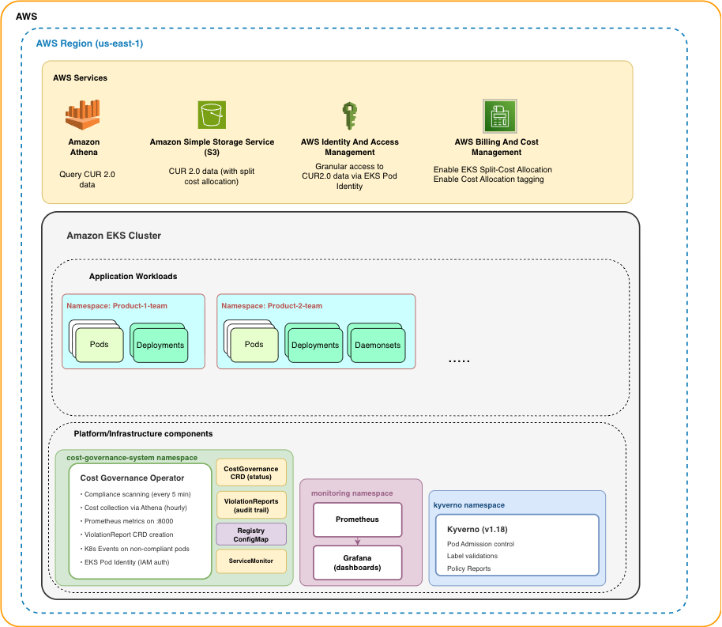

# Cost Governance Operator

A Kubernetes operator for EKS cost observability, attribution, and governance using AWS Split-Cost Allocation Data (CUR 2.0).

[](https://kubernetes.io/)
[](https://aws.amazon.com/eks/)
[](https://www.python.org/)

---

## Table of Contents

- [Introduction](#introduction)
- [Features](#features)
- [Architecture](#architecture)
- [Prerequisites](#prerequisites)
- [Installation](#installation)
- [Verification](#verification)
- [Metrics & Observability](#metrics--observability)
- [Cost Attribution](#cost-attribution)
- [Violation Reports](#violation-reports)
- [Configuration & Customization](#configuration--customization)
- [Grafana Dashboard](#grafana-dashboard)
- [Troubleshooting](#troubleshooting)
- [Advanced Usage](#advanced-usage)

---

## Introduction

### What is the Cost Governance Operator?

AWS Split-Cost Allocation for EKS is a powerful feature — it breaks down shared node costs to individual pods in Cost and Usage Reports, giving you granular cost observability that wasn't possible before. Add cost-allocation tags, and you can further enrich your CUR reports to give you detailed insignts.  But visibility alone isn't enough. Without governance, that data is only as good as the labels on your workloads. If workloads are missing required tags, or if tags are used inconsistently your cost data will be fragmented and inaccureate. Your cost reports will up with "unallocated" line items and inconsistent data and stop being trustworthy.

The Cost Governance Operator bridges that gap. It's a Kubernetes operator that runs alongside your workloads on EKS and continuously validates that pods have the correct cost attribution labels, checks those values against an approved registry, and reports violations before they turn into orphaned costs. It also queries your CUR 2.0 data through Athena to surface actual dollar costs attributed to teams, namespaces, and applications — and separates application spend from cluster infrastructure overhead like Karpenter, CoreDNS, and monitoring.


### How It Works

```
┌─────────────────┐         ┌──────────────────┐         ┌─────────────────┐
│   AWS Athena    │◄────────│  Cost Operator   │────────►│   Kubernetes    │
│   (CUR 2.0)     │  Query  │  (Kopf-based)    │  Scan   │   API Server    │
└─────────────────┘         └──────────────────┘         └─────────────────┘
                                     │
                                     ▼
                            ┌──────────────────┐
                            │   Prometheus     │
                            │   (15 metrics)   │
                            └──────────────────┘
                                     │
                                     ▼
                            ┌──────────────────┐
                            │     Grafana      │
                            │   (Dashboards)   │
                            └──────────────────┘
```

**Data Sources:**
- **AWS Cost and Usage Reports (CUR 2.0)** - Pod-level cost data with EKS split-cost allocation
- **Kubernetes API** - Live pod metadata, labels, and compliance state

**Outputs:**
- **CRD Status** - Cost and compliance data stored in `CostGovernance` resource status
- **ViolationReports** - Detailed, queryable compliance reports created after every scan
- **Kubernetes Events** - Per-pod `ComplianceViolation` warnings visible in `kubectl describe pod`
- **Prometheus Metrics** - 15 metrics for cost, compliance, and performance
- **Grafana Dashboards** - Visual representation of cost trends and violations

### Key Benefits

- Real-time cost visibility directly in Kubernetes
- Attribute costs to teams with multiple dimensions (team, business unit, cost center, application, environment, etc.)
- Understand your platform costs vs application workload costs.
- Catch missing labels before they become orphaned costs
- Define governance policies as code in CRDs

---

## Features

### Cost Collection & Attribution
- ✅ **Hourly cost collection** from AWS Athena (CUR 2.0)
- ✅ **Namespace-level costs** - Understand which namespaces are most expensive
- ✅ **Cluster infrastructure breakdown** - Separate application costs from platform costs
- ✅ **Component-level detail** - See costs for CoreDNS, EBS CSI, Karpenter, Prometheus, etc.
- ✅ **Tagged vs untagged cost tracking** - Measure attribution coverage

### Compliance & Governance
- ✅ **Continuous pod scanning** (every 5 minutes)
- ✅ **Required label validation** - Ensure all pods have cost center, team, etc.
- ✅ **Allowed value validation** - Check labels against approved registries
- ✅ **ViolationReport CRDs** - Persistent, queryable compliance reports created after every scan
- ✅ **Kubernetes Events** - Per-pod `ComplianceViolation` warnings on non-compliant pods
- ✅ **Automatic report retention** - Old ViolationReports cleaned up, keeping the most recent 7
- ✅ **Violation tracking by namespace** - Identify which teams need help
- ✅ **Violation tracking by label** - Find the most commonly missing labels
- ✅ **Compliance rate calculation** - Overall percentage of compliant pods

### Observability
- ✅ **15 Prometheus metrics** exposed at `/metrics`
- ✅ **ServiceMonitor auto-discovery** for Prometheus Operator
- ✅ **Pre-built Grafana dashboard** with 17 panels
- ✅ **Performance metrics** - Scan duration and error rates
- ✅ **Operator version info** - Track deployed version

---

## Architecture

### Components



### AWS Integration

- **EKS Pod Identity**: Operator uses EKS Pod Identity to assume an IAM role
- **IAM Permissions**: Athena query execution, S3 read access to CUR bucket, Glue catalog access
- **CUR 2.0**: AWS Cost and Usage Reports with EKS split-cost allocation enabled
- **Athena Database**: (configurable via deployment.yaml

---

## Prerequisites

### 1. EKS Cluster with Split-Cost Allocation

Verify **split-cost allocation** is enabled in your Billing and Cost Management Console. to track pod-level costs. Additionally verify CUR report contains 'split_line_item_split_cost' column. (Note: data can take up to 24 hours to appear after enabling)


### 2. AWS Cost and Usage Reports (CUR 2.0)

You must have CUR 2.0 enabled with Athena integration.


### 4. Monitoring Stack (Prometheus + Grafana)

The operator exports metrics to Prometheus. You need Prometheus Operator with Grafana.

**Verify monitoring stack:**
```bash
# Check Prometheus
kubectl get prometheus -n monitoring

# Check Grafana
kubectl get deployment -n monitoring prometheus-grafana
```

**Install Prometheus + Grafana (using kube-prometheus-stack):**
```bash
helm repo add prometheus-community https://prometheus-community.github.io/helm-charts
helm repo update

helm install prometheus prometheus-community/kube-prometheus-stack \
  --namespace monitoring --create-namespace \
  --set prometheus.prometheusSpec.serviceMonitorSelectorNilUsesHelmValues=false
```

### 5. Tools

Ensure you have these tools installed:

```bash
# kubectl
kubectl version --client

# aws CLI
aws --version

# docker
docker --version

# make
make --version

# jq (for JSON parsing)
jq --version
```

---

## Installation

### Step 1: Configure for Your Environment

Update the deployment environment variables in `operator/k8s_configs/deployment/deployment.yaml`:

```yaml
env:
  - name: AWS_REGION
    value: "us-east-1"              # Your AWS region
  - name: ATHENA_DATABASE
    value: "billingdata"            # Your CUR Athena database name
  - name: ATHENA_TABLE
    value: "data"                   # Your CUR table name
  - name: ATHENA_S3_OUTPUT
    value: "s3://your-bucket/queryresults/"  # S3 path for Athena query results
  - name: EKS_CLUSTER_NAME
    value: "your-cluster-name"      # Auto-detected if not set, but explicit is safer
  - name: COST_LOOKBACK_DAYS
    value: "7"                      # Number of days of cost data to query
```

### Step 2: Update IAM Policy

Edit `operator/k8s_configs/iam/athena-access-policy.json` and update the S3 bucket ARNs to match your account:

```json
{
  "Sid": "S3AthenaResultsBucket",
  "Resource": [
    "arn:aws:s3:::your-bucket",
    "arn:aws:s3:::your-bucket/*"
  ]
},
{
  "Sid": "S3CURDataRead",
  "Resource": [
    "arn:aws:s3:::your-cur-bucket",
    "arn:aws:s3:::your-cur-bucket/*"
  ]
}
```

If your CUR data and Athena results share the same bucket (different prefixes), use the same bucket ARN for both statements.

### Step 3: Build and Push Image

```bash
make push AWS_PROFILE=your-profile
```

This will:
- Create the ECR repository if it doesn't exist
- Build the Docker image (linux/amd64)
- Authenticate to ECR
- Tag and push the image

### Step 4: Deploy the Operator

```bash
make deploy-all AWS_PROFILE=your-profile
```

This will:
- Install the EKS Pod Identity Agent addon (if not already present)
- Create IAM role (`CostGovernanceOperatorRole`) with Athena/S3 permissions
- Create EKS Pod Identity association
- Deploy CRDs (`CostGovernance`, `ViolationReport`)
- Deploy the operator, service, and ServiceMonitor to `cost-governance-system` namespace

### Step 5: Create a CostGovernance Instance

```bash
make deploy-governance AWS_PROFILE=your-profile
```

Or create manually:

```yaml
apiVersion: cost-governance.io/v1alpha1
kind: CostGovernance
metadata:
  name: default-governance
  namespace: cost-governance-system
spec:
  enforcementMode: audit
  requiredLabels:
    - cost-center
    - business-unit
    - team
    - application
    - environment
  registryConfigMap:
    name: cost-governance-registry
    namespace: cost-governance-system
```

### Step 6: Verify

```bash
# Check operator is running
kubectl get pods -n cost-governance-system

# Check cost and compliance data (cost data appears within ~1 min, compliance within 5 min)
kubectl get cg -n cost-governance-system -o wide
```

Expected output:
```
NAME                 TOTAL COST   APP COST   INFRA COST   COMPLIANCE   ATTRIBUTION   TOTAL PODS   AGE
default-governance   $18.13       $2.74      $10.28       36.67        7.7           252          5m
```

---

## Verification

### 1. Verify Operator is Running

```bash
# Check pod status
kubectl get pods -n cost-governance-system

# Expected output:
# NAME                                        READY   STATUS    RESTARTS   AGE
# cost-governance-operator-<hash>             1/1     Running   0          2m
```

### 2. Check Operator Logs

```bash
make logs

# Or manually:
kubectl logs -n cost-governance-system -l app=cost-governance-operator -f
```

**Look for:**
```
INFO: Prometheus metrics server started on port 8000 at /metrics
INFO: Kopf operator started
INFO: Handler 'create_fn' succeeded.
```

### 3. Verify CostGovernance Resource

```bash
kubectl get cg -n cost-governance-system

# Expected output:
# NAME                 TOTAL COST   APP COST   INFRA COST   AGE
# default-governance   $10.87       $1.50      $9.37        5m
```

### 4. Check Cost Collection Status

```bash
kubectl get cg default-governance -n cost-governance-system -o jsonpath='{.status.costData}' | jq .
```

**Expected output:**
```json
{
  "totalCost": "10.87",
  "attributionRate": "13.80",
  "taggedCost": "1.50",
  "untaggedCost": "9.37",
  "lastCollectionTime": "2026-04-26T10:30:00Z",
  "clusterCostBreakdown": {
    "applicationCost": "1.50",
    "clusterInfrastructureCost": "9.37",
    "byComponent": [...]
  }
}
```

### 5. Verify Prometheus Metrics

**Port-forward to operator:**
```bash
kubectl port-forward -n cost-governance-system svc/cost-governance-operator 8000:8000
```

**Check metrics endpoint:**
```bash
curl http://localhost:8000/metrics | grep "^cost_governance"
```

**Expected output:**
```
cost_governance_total_cost_usd{cluster="your-cluster"} 10.87
cost_governance_attribution_rate{cluster="your-cluster"} 13.80
cost_governance_compliance_rate{governance_name="default-governance"} 36.67
...
```

### 6. Verify ServiceMonitor

```bash
kubectl get servicemonitor -n monitoring cost-governance-operator
```

**Expected output:**
```
NAME                        AGE
cost-governance-operator    5m
```

### 7. Check Prometheus is Scraping

**Port-forward to Prometheus:**
```bash
kubectl port-forward -n monitoring svc/prometheus-kube-prometheus-prometheus 9090:9090
```

**Open Prometheus UI:**
```
http://localhost:9090
```

**Query for metrics:**
```promql
cost_governance_total_cost_usd
```

**Expected:** Should return data points

### 8. Verify Grafana Dashboard (Optional)

**Port-forward to Grafana:**
```bash
kubectl port-forward -n monitoring svc/prometheus-grafana 3000:80
```

**Get Grafana admin password:**
```bash
kubectl get secret -n monitoring prometheus-grafana \
  -o jsonpath="{.data.admin-password}" | base64 --decode; echo
```

**Open Grafana:**
```
http://localhost:3000
```

**Import dashboard:**
- See [Grafana Dashboard](#grafana-dashboard) section below

---

## Metrics & Observability

The operator exposes **15 Prometheus metrics** at `http://<service>:8000/metrics`.

For complete metrics documentation, see: [`PROMETHEUS-METRICS.md`](./operator/PROMETHEUS-METRICS.md)

### Metrics Summary

#### Cost Metrics (7 metrics)

| Metric | Type | Description |
|--------|------|-------------|
| `cost_governance_total_cost_usd` | Gauge | Total EKS cluster cost in USD |
| `cost_governance_attribution_rate` | Gauge | % of costs attributed to teams (0-100) |
| `cost_governance_tagged_cost_usd` | Gauge | Cost properly attributed with labels |
| `cost_governance_untagged_cost_usd` | Gauge | Cost not attributed (missing labels) |
| `cost_governance_namespace_cost_usd` | Gauge | Cost breakdown by namespace |
| `cost_governance_team_cost_usd` | Gauge | Cost breakdown by team |
| `cost_governance_pod_count` | Gauge | Total pods with cost data |

#### Compliance Metrics (7 metrics)

| Metric | Type | Description |
|--------|------|-------------|
| `cost_governance_compliance_rate` | Gauge | Overall compliance rate % (0-100) |
| `cost_governance_total_pods` | Gauge | Total pods scanned |
| `cost_governance_compliant_pods` | Gauge | Number of compliant pods |
| `cost_governance_violating_pods` | Gauge | Number of pods with violations |
| `cost_governance_violations_by_type` | Gauge | Violations by type (MissingLabel, InvalidValue) |
| `cost_governance_violations_by_namespace` | Gauge | Violations per namespace |
| `cost_governance_violations_by_label` | Gauge | Violations per label name |

#### Performance Metrics (2 metrics)

| Metric | Type | Description |
|--------|------|-------------|
| `cost_governance_scan_duration_seconds` | Histogram | Compliance scan duration (with percentiles) |
| `cost_governance_scan_errors_total` | Counter | Total scan errors by type |

#### Info Metric (1 metric)

| Metric | Type | Description |
|--------|------|-------------|
| `cost_governance_operator_info` | Gauge | Operator version and phase |

### Example Queries

**Total cluster cost:**
```promql
cost_governance_total_cost_usd
```

**Top 5 expensive namespaces:**
```promql
topk(5, cost_governance_namespace_cost_usd)
```

**Compliance rate over time:**
```promql
cost_governance_compliance_rate[1h]
```

**Most commonly missing label:**
```promql
topk(1, cost_governance_violations_by_label)
```

---

## Cost Attribution

The operator collects cost data **every hour** from AWS Athena and stores it in the `CostGovernance` resource status.

### Collection Schedule

- **Cost collection:** Every 60 minutes (configurable via `spec.collectionSchedule`)
- **Compliance scanning:** Every 5 minutes (configurable via `spec.complianceScanInterval`)
- **Metrics scrape:** Every 30 seconds (Prometheus ServiceMonitor default)

### Attribution Dimensions

The operator tracks costs across **10 dimensions** based on Kubernetes labels:

| Dimension | Kubernetes Label | Example Value |
|-----------|------------------|---------------|
| Team | `team` | `platform-team` |
| Business Unit | `business-unit` | `engineering` |
| Cost Center | `cost-center` | `CC-1234` |
| Application | `application` | `api-gateway` |
| Environment | `environment` | `production` |
| Owner | `owner` | `john.doe@company.com` |
| Project | `project` | `project-alpha` |
| Product | `product` | `mobile-app` |
| Service | `service` | `authentication` |
| Workload | `app.kubernetes.io/name` | `nginx` |

### Cost Breakdown Structure

The operator provides cost data in three levels:

#### 1. Cluster-Level Totals

```bash
kubectl get cg default-governance -n cost-governance-system -o jsonpath='{.status.costData}' | jq '{totalCost, taggedCost, untaggedCost, attributionRate}'
```

**Example output:**
```json
{
  "totalCost": "10.87",
  "taggedCost": "1.50",
  "untaggedCost": "9.37",
  "attributionRate": "13.80"
}
```

#### 2. Namespace-Level Costs

```bash
kubectl get cg default-governance -n cost-governance-system \
  -o jsonpath='{.status.costData.namespaces}' | jq .
```

**Example output:**
```json
[
  {"namespace": "karpenter", "totalCost": "6.36", "podCount": 1},
  {"namespace": "kube-system", "totalCost": "2.28", "podCount": 10},
  {"namespace": "test-apps", "totalCost": "0.80", "podCount": 5},
  {"namespace": "monitoring", "totalCost": "0.65", "podCount": 7}
]
```

#### 3. Cluster Infrastructure Breakdown

The operator separates **application costs** from **infrastructure costs** and categorizes infrastructure by purpose:

```bash
kubectl get cg default-governance -n cost-governance-system \
  -o jsonpath='{.status.costData.clusterCostBreakdown}' | jq .
```

**Example output:**
```json
{
  "applicationCost": "1.50",
  "clusterInfrastructureCost": "9.37",
  "byComponent": [
    {
      "category": "operations",
      "component": "karpenter",
      "namespace": "karpenter",
      "totalCost": "6.36",
      "podCount": 1,
      "description": "Karpenter node provisioner"
    },
    {
      "category": "platform",
      "component": "coredns",
      "namespace": "kube-system",
      "totalCost": "0.62",
      "podCount": 2,
      "description": "CoreDNS cluster DNS"
    },
    {
      "category": "observability",
      "component": "prometheus",
      "namespace": "monitoring",
      "totalCost": "0.54",
      "podCount": 1,
      "description": "Prometheus metrics server"
    }
  ]
}
```

### Infrastructure Categories

| Category | Purpose | Example Components |
|----------|---------|-------------------|
| **platform** | Core Kubernetes services | CoreDNS, kube-proxy, metrics-server |
| **operations** | Node/cluster operations | Karpenter, EBS CSI driver, Pod Identity Agent |
| **observability** | Monitoring and logging | Prometheus, Grafana, Node Exporter, Alertmanager |
| **governance** | Cost and policy enforcement | Cost Governance Operator |

### Team-Level Cost Attribution

For pods with proper team labels:

```bash
kubectl get cg default-governance -n cost-governance-system \
  -o jsonpath='{.status.costData.teams}' | jq .
```

**Example output:**
```json
[
  {
    "team": "platform-team",
    "businessUnit": "engineering",
    "totalCost": "0.80",
    "podCount": 5
  },
  {
    "team": "data-team",
    "businessUnit": "engineering",
    "totalCost": "0.70",
    "podCount": 3
  }
]
```

### Trigger Cost Collection Manually

Cost collection runs hourly, but you can trigger it manually:

```bash
kubectl annotate cg default-governance -n cost-governance-system \
  cost-governance.io/trigger-cost-collection="$(date +%s)" --overwrite
```

Check logs:
```bash
kubectl logs -n cost-governance-system -l app=cost-governance-operator --tail=50 | grep "Cost collection complete"
```

---

## Violation Reports

Every compliance scan that finds non-compliant pods creates a `ViolationReport` custom resource. These reports are persistent, queryable, and give you a detailed audit trail of compliance state over time.

### List Violation Reports

```bash
kubectl get violationreports -n cost-governance-system
```

**Example output:**
```
NAME                                 SCAN TIME                          TOTAL PODS   VIOLATIONS   COMPLIANCE %   AGE
default-governance-20260427-172343   2026-04-27T17:23:43.853765+00:00   30           19           36.67          31m
default-governance-20260427-172844   2026-04-27T17:28:44.669755+00:00   30           19           36.67          26m
default-governance-20260427-173345   2026-04-27T17:33:45.368532+00:00   30           19           36.67          21m
```

Reports are named `{governance-name}-{YYYYMMDD-HHMMSS}` and created every 5 minutes (matching the compliance scan interval). The operator automatically retains the most recent 7 reports and cleans up older ones.

### Inspect a Violation Report

```bash
kubectl get violationreport default-governance-20260427-172343 \
  -n cost-governance-system -o yaml
```

Each report includes:
- **Scan summary** — total pods, compliant pods, violating pods, compliance rate
- **Violation list** — every non-compliant pod with its namespace, current labels, and specific violations
- **Violation summary** — counts broken down by type (`MissingLabel`, `InvalidValue`), by namespace, and by label

### Query Violations

**Get the violation list from the latest report:**
```bash
kubectl get vr -n cost-governance-system --sort-by=.spec.scanTime -o name | tail -1 | \
  xargs kubectl get -n cost-governance-system -o json | jq '.spec.violations'
```

**Get the violation summary (counts by type, namespace, label):**
```bash
kubectl get vr -n cost-governance-system --sort-by=.spec.scanTime -o name | tail -1 | \
  xargs kubectl get -n cost-governance-system -o json | jq '.spec.violationSummary'
```

**Example violation summary:**
```json
{
  "byType": {
    "MissingLabel": 45,
    "InvalidValue": 3
  },
  "byNamespace": {
    "test-compliance": 12,
    "default": 7
  },
  "byLabel": {
    "cost-center": 19,
    "business-unit": 15,
    "team": 11
  }
}
```

### Kubernetes Events

In addition to ViolationReport CRDs, the operator creates Kubernetes Events on each non-compliant pod. These show up in `kubectl describe pod`:

```bash
kubectl get events --all-namespaces --field-selector reason=ComplianceViolation
```

Events have a default 1-hour TTL, so ViolationReports are the durable record.

---

## Configuration & Customization

### CostGovernance CRD Spec

The `CostGovernance` CRD defines governance policies for your cluster.

**Full example:**
```yaml
apiVersion: cost-governance.io/v1alpha1
kind: CostGovernance
metadata:
  name: default-governance
  namespace: cost-governance-system
spec:
  # Enforcement mode
  enforcementMode: audit  # or "enforce"
  
  # Required cost attribution labels
  requiredLabels:
  - cost-center
  - business-unit
  - team
  - application
  - environment
  
  # Label value validation (optional)
  labelValidation:
    team:
      allowedValues:
      - platform-team
      - data-team
      - mobile-team
    business-unit:
      allowedValues:
      - engineering
      - product
      - sales
    environment:
      allowedValues:
      - production
      - staging
      - development
  
  # Cost collection schedule (cron format)
  collectionSchedule: "0 * * * *"  # Every hour
  
  # Compliance scan interval (seconds)
  complianceScanInterval: 300  # Every 5 minutes
  
  # Resource thresholds (optional)
  resourceThresholds:
    cpu: "4"
    memory: "16Gi"
    requiresGpuApproval: true
```

### Spec Fields Reference

| Field | Type | Default | Description |
|-------|------|---------|-------------|
| `enforcementMode` | string | `audit` | `audit` (log only) or `enforce` (block non-compliant pods) |
| `requiredLabels` | array | `[cost-center, business-unit, team, application, environment]` | Labels required on all pods |
| `labelValidation.<label>.allowedValues` | array | `[]` | Allowed values for specific labels |
| `collectionSchedule` | string | `"0 * * * *"` | Cron schedule for cost collection (hourly recommended) |
| `complianceScanInterval` | int | `300` | Seconds between compliance scans |
| `resourceThresholds.cpu` | string | `"4"` | CPU threshold for approval |
| `resourceThresholds.memory` | string | `"16Gi"` | Memory threshold for approval |
| `resourceThresholds.requiresGpuApproval` | bool | `true` | GPU requires approval |

### Environment Variables

The operator supports these environment variables (set in `k8s_configs/deployment/deployment.yaml`):

| Variable | Default | Description |
|----------|---------|-------------|
| `EKS_CLUSTER_NAME` | Required | Name of your EKS cluster |
| `ATHENA_DATABASE` | `athenacurcfn_brdcost_cur2` | Athena database name for CUR data |
| `ATHENA_OUTPUT_BUCKET` | Required | S3 bucket for Athena query results (format: `s3://bucket/prefix/`) |
| `AWS_REGION` | `us-east-1` | AWS region for Athena queries |
| `LOG_LEVEL` | `INFO` | Logging level (`DEBUG`, `INFO`, `WARNING`, `ERROR`) |

**Example:**
```yaml
env:
- name: EKS_CLUSTER_NAME
  value: "prod-eks-cluster"
- name: ATHENA_DATABASE
  value: "athenacurcfn_my_company_cur2"
- name: ATHENA_OUTPUT_BUCKET
  value: "s3://my-athena-results/cost-governance/"
- name: LOG_LEVEL
  value: "DEBUG"
```

### Customize Required Labels

To change which labels are required:

```bash
kubectl edit cg default-governance -n cost-governance-system
```

Update `spec.requiredLabels`:
```yaml
spec:
  requiredLabels:
  - cost-center
  - business-unit
  - team
  - owner  # Added
  - project  # Added
```

### Change Collection Frequency

**More frequent cost collection (every 30 minutes):**
```yaml
spec:
  collectionSchedule: "*/30 * * * *"
```

**Daily cost collection (6 AM UTC):**
```yaml
spec:
  collectionSchedule: "0 6 * * *"
```

**Less frequent compliance scans (every 15 minutes):**
```yaml
spec:
  complianceScanInterval: 900  # seconds
```

### Customize Infrastructure Categories

To modify which namespaces or components are categorized as infrastructure, edit:

**File:** `src/utils/cluster_infrastructure_config.py`

**Add new namespace category:**
```python
NAMESPACE_CATEGORIES = {
    "kube-system": "platform",
    "monitoring": "observability",
    "karpenter": "operations",
    "cost-governance-system": "governance",
    "logging": "observability",  # Add this
}
```

**Add new component:**
```python
ComponentConfig(
    name="fluentd",
    category="observability",
    description="Fluentd log aggregator",
    pod_patterns=[r"^fluentd-.*"]
),
```

After changes, rebuild and redeploy:
```bash
make push
kubectl rollout restart deployment/cost-governance-operator -n cost-governance-system
```

---

## Grafana Dashboard

A pre-built Grafana dashboard is provided with **17 panels** covering all cost, compliance, and performance metrics.

### Dashboard Features

**Cost Overview (6 panels):**
- Total Cluster Cost (gauge with thresholds)
- Cost Attribution Rate (percentage gauge)
- Tagged vs Untagged Costs (pie chart)
- Cost Trend (timeseries)
- Cost by Namespace (bar chart)
- Pod Count with cost data (stat)

**Compliance Overview (7 panels):**
- Compliance Rate (gauge with thresholds)
- Compliant vs Violating Pods (donut chart)
- Violations by Type (pie chart)
- Pod Summary (stats)
- Violations by Namespace (bar chart)
- Violations by Label (bar chart)
- Compliance Trend (timeseries)

**Performance Metrics (4 panels):**
- Scan Duration (average and P95)
- Scan Errors Rate (timeseries)
- Total Scans (counter)
- Operator Version (info panel)

### Import Dashboard

**Method 1: Grafana UI (Recommended)**

1. Port-forward to Grafana:
   ```bash
   kubectl port-forward -n monitoring svc/prometheus-grafana 3000:80
   ```

2. Get admin password:
   ```bash
   kubectl get secret -n monitoring prometheus-grafana \
     -o jsonpath="{.data.admin-password}" | base64 --decode; echo
   ```

3. Open Grafana: http://localhost:3000

4. Import dashboard:
   - Click **"+"** (Create) → **"Import"**
   - Click **"Upload JSON file"**
   - Select: `grafana-dashboard/cost-governance-dashboard.json`
   - Select **Prometheus** datasource
   - Click **"Import"**

**Method 2: ConfigMap Auto-Discovery**

If your Grafana is configured to auto-discover dashboards:

```bash
kubectl create configmap cost-governance-dashboard \
  --from-file=cost-governance-dashboard.json=./grafana-dashboard/cost-governance-dashboard.json \
  -n monitoring \
  --dry-run=client -o yaml | \
  kubectl label -f - grafana_dashboard=1 --local --dry-run=client -o yaml | \
  kubectl apply -f -
```

### Dashboard Documentation

For complete dashboard documentation (panel queries, customization, troubleshooting), see:

**[`grafana-dashboard/README.md`](./grafana-dashboard/README.md)**

---

## Troubleshooting

### Operator Pod Not Starting

**Check pod status:**
```bash
kubectl get pods -n cost-governance-system
kubectl describe pod -n cost-governance-system -l app=cost-governance-operator
```

**Common issues:**
- Image pull failure → Verify ECR repository exists and credentials are correct
- CrashLoopBackOff → Check logs: `kubectl logs -n cost-governance-system -l app=cost-governance-operator`

### Cost Data Not Collected

**Symptom:** `kubectl get cg` shows `TOTAL COST` as empty or `$0.00`

**Check 1: Cost collection has run**
```bash
kubectl logs -n cost-governance-system -l app=cost-governance-operator | grep "Cost collection complete"
```

**Check 2: IAM permissions**
```bash
# Verify Pod Identity association
aws eks list-pod-identity-associations --cluster-name <cluster> --region us-east-1

# Check IAM role exists
aws iam get-role --role-name CostGovernanceOperatorRole
```

**Check 3: Athena database**
```bash
aws athena list-databases --catalog-name AwsDataCatalog --region us-east-1 \
  --query "DatabaseList[?Name=='athenacurcfn_brdcost_cur2']"
```

**Check 4: Trigger manual collection**
```bash
kubectl annotate cg default-governance -n cost-governance-system \
  cost-governance.io/trigger-cost-collection="$(date +%s)" --overwrite
```

### Prometheus Metrics Not Appearing

**Symptom:** Queries in Prometheus return "No data"

**Check 1: Metrics endpoint**
```bash
kubectl port-forward -n cost-governance-system svc/cost-governance-operator 8000:8000
curl http://localhost:8000/metrics | grep cost_governance
```

**Check 2: ServiceMonitor**
```bash
kubectl get servicemonitor -n monitoring cost-governance-operator
```

**Check 3: Prometheus targets**
```bash
kubectl port-forward -n monitoring svc/prometheus-kube-prometheus-prometheus 9090:9090
# Open: http://localhost:9090/targets
# Look for: monitoring/cost-governance-operator (should be UP)
```

**Check 4: ServiceMonitor labels**
```bash
# Verify ServiceMonitor has correct labels
kubectl get servicemonitor -n monitoring cost-governance-operator -o yaml | grep -A 3 "labels:"
# Should include: release: prometheus
```

### Compliance Rate is 0%

**Symptom:** `cost_governance_compliance_rate` metric is 0

**Check 1: Compliance scan has run**
```bash
kubectl logs -n cost-governance-system -l app=cost-governance-operator | grep "Compliance scan complete"
```

**Check 2: Pods are being scanned**
```bash
kubectl get cg default-governance -n cost-governance-system -o jsonpath='{.status.compliance}' | jq .
```

**Check 3: Trigger manual scan**
```bash
kubectl annotate cg default-governance -n cost-governance-system \
  cost-governance.io/trigger-scan="$(date +%s)" --overwrite
```

### Grafana Dashboard Shows "No Data"

**Check 1: Metrics are flowing to Prometheus**
```bash
# Query Prometheus directly
kubectl port-forward -n monitoring svc/prometheus-kube-prometheus-prometheus 9090:9090
# Open: http://localhost:9090
# Query: cost_governance_total_cost_usd
```

**Check 2: Datasource is configured**
- In Grafana, go to **Configuration → Data Sources**
- Verify **Prometheus** datasource exists and is set as default

**Check 3: Time range**
- Cost data is collected hourly, so ensure your Grafana time range includes the last collection
- Try setting time range to "Last 24 hours"

### High Scan Duration

**Symptom:** `cost_governance_scan_duration_seconds` is high (> 5 seconds)

**Possible causes:**
- Large number of pods (> 1000)
- Slow Kubernetes API responses
- Network latency

**Solutions:**
- Increase scan interval: `spec.complianceScanInterval: 600` (10 minutes)
- Add resource requests/limits to operator deployment
- Check cluster health: `kubectl get nodes` and `kubectl top nodes`

### Operator Logs Show Athena Errors

**Common errors:**

**Error:** `SYNTAX_ERROR: line X: Unexpected token`
- **Cause:** Invalid Athena SQL query
- **Solution:** Check `ATHENA_DATABASE` environment variable matches your CUR database

**Error:** `INVALID_INPUT_EXCEPTION: S3 bucket does not exist`
- **Cause:** Invalid `ATHENA_OUTPUT_BUCKET`
- **Solution:** Verify S3 bucket exists and operator has write permissions

**Error:** `Access Denied`
- **Cause:** IAM role missing permissions
- **Solution:** Verify IAM policy includes `athena:StartQueryExecution`, `s3:GetObject`, `s3:PutObject`, `glue:GetDatabase`

---

## Kyverno Governance Policies

The `governance_policies/` folder contains Kyverno `ValidatingPolicy` resources (requires Kyverno v1.18+) that enforce cost attribution labels at admission time:

- **`kyverno-require-cost-labels.yaml`** — Validates that pods have all required labels (`cost-center`, `business-unit`, `team`, `application`, `environment`)
- **`kyverno-validate-cost-label-values.yaml`** — Validates label values match approved formats and lists (environment must be `dev`/`staging`/`prod`, cost-center must match `CC-NNNN`, etc.)

Deploy with:
```bash
kubectl apply -f governance_policies/
```

Check violations:
```bash
kubectl get policyreport -A
```

> **Note:** The Kyverno value validation policy uses hardcoded allowed values in the CEL expressions. If you add new business units, cost centers, or environments, you must update the policy YAML and re-apply. For dynamic value validation that reads from a central registry without policy redeployment, use the operator's ConfigMap-based registry (`registryConfigMap` in the CostGovernance spec). The two approaches are complementary: Kyverno blocks at admission, the operator scans continuously.

---

## Advanced Usage

### Multiple Governance Policies

You can create multiple `CostGovernance` resources for different governance needs:

```bash
# Production governance (strict)
kubectl apply -f - <<EOF
apiVersion: cost-governance.io/v1alpha1
kind: CostGovernance
metadata:
  name: production-governance
  namespace: cost-governance-system
spec:
  enforcementMode: enforce
  requiredLabels:
  - cost-center
  - business-unit
  - team
  - application
  - environment
  - owner
  complianceScanInterval: 300
EOF

# Development governance (relaxed)
kubectl apply -f - <<EOF
apiVersion: cost-governance.io/v1alpha1
kind: CostGovernance
metadata:
  name: development-governance
  namespace: cost-governance-system
spec:
  enforcementMode: audit
  requiredLabels:
  - team
  - application
  complianceScanInterval: 600
EOF
```

### Export Cost Data to CSV

```bash
kubectl get cg default-governance -n cost-governance-system \
  -o jsonpath='{.status.costData.namespaces}' | \
  jq -r '.[] | [.namespace, .totalCost, .podCount] | @csv' > namespace-costs.csv
```

### Alerting on Cost Thresholds

Create Prometheus alerting rules:

```yaml
apiVersion: monitoring.coreos.com/v1
kind: PrometheusRule
metadata:
  name: cost-governance-alerts
  namespace: monitoring
spec:
  groups:
  - name: cost-governance
    interval: 5m
    rules:
    - alert: HighClusterCost
      expr: cost_governance_total_cost_usd > 100
      for: 1h
      annotations:
        summary: "Cluster cost exceeds $100"
        description: "Total cluster cost is ${{ $value }}"
    
    - alert: LowAttributionRate
      expr: cost_governance_attribution_rate < 20
      for: 1h
      annotations:
        summary: "Cost attribution rate below 20%"
        description: "Only {{ $value }}% of costs can be attributed"
    
    - alert: LowComplianceRate
      expr: cost_governance_compliance_rate < 50
      for: 15m
      annotations:
        summary: "Compliance rate below 50%"
        description: "Only {{ $value }}% of pods are compliant"
```

### CI/CD Integration

Add governance validation to your CI/CD pipeline:

```bash
#!/bin/bash
# validate-labels.sh

# Check compliance rate
COMPLIANCE=$(kubectl get cg default-governance -n cost-governance-system \
  -o jsonpath='{.status.compliance.complianceRate}')

if (( $(echo "$COMPLIANCE < 80" | bc -l) )); then
  echo "ERROR: Compliance rate is ${COMPLIANCE}%, must be >= 80%"
  exit 1
fi

echo "✅ Compliance rate: ${COMPLIANCE}%"
```

### Local Development

Run the operator locally (outside cluster) for development:

```bash
# Install dependencies
pip install -r requirements.txt

# Set environment variables
export EKS_CLUSTER_NAME=your-cluster
export ATHENA_DATABASE=athenacurcfn_brdcost_cur2
export ATHENA_OUTPUT_BUCKET=s3://your-bucket/athena-results/
export AWS_REGION=us-east-1
export KUBECONFIG=~/.kube/config

# Run operator
kopf run --standalone --liveness=http://0.0.0.0:8080/healthz src/main.py
```

---

## Cleanup

### Remove Operator

```bash
make undeploy
```

This will:
- Delete operator deployment
- Delete CRDs
- Delete namespace

### Remove AWS Resources

```bash
# Get Pod Identity association ID
ASSOCIATION_ID=$(aws eks list-pod-identity-associations \
  --cluster-name <cluster> --region us-east-1 \
  --query "associations[?serviceAccount=='cost-governance-operator'].associationId" \
  --output text)

# Delete Pod Identity association
aws eks delete-pod-identity-association \
  --cluster-name <cluster> \
  --association-id $ASSOCIATION_ID \
  --region us-east-1

# Delete IAM role policy
aws iam delete-role-policy \
  --role-name CostGovernanceOperatorRole \
  --policy-name AthenaAccess

# Delete IAM role
aws iam delete-role --role-name CostGovernanceOperatorRole
```

---

## References

- [AWS Split-Cost Allocation](https://aws.amazon.com/blogs/aws-cloud-financial-management/using-kubernetes-labels-to-split-and-track-application-costs-on-amazon-eks-2/)
- [EKS Pod Identity](https://docs.aws.amazon.com/eks/latest/userguide/pod-identities.html)
- [AWS Cost and Usage Reports](https://docs.aws.amazon.com/cur/latest/userguide/what-is-cur.html)
- [Kopf Framework](https://kopf.readthedocs.io/)
- [Prometheus Operator](https://prometheus-operator.dev/)
- [Karpenter](https://karpenter.sh/)

---

## License

MIT License - see [LICENSE](../LICENSE) file for details.

---

## Contributing

Contributions welcome! Please open an issue or pull request.

**Development workflow:**
1. Fork repository
2. Create feature branch
3. Make changes
4. Test locally (see [Local Development](#local-development))
5. Submit pull request

---

## Support

For issues, questions, or feature requests:
- Open an issue on GitHub
- Check [Troubleshooting](#troubleshooting) section
- Review operator logs: `kubectl logs -n cost-governance-system -l app=cost-governance-operator`

---

**Quick Start Cheat Sheet:**

```bash
# 1. Build and deploy
make push && make deploy-all

# 2. Create governance policy
kubectl apply -f examples/cost-governance.yaml

# 3. Check status
kubectl get cg -n cost-governance-system

# 4. View cost data
kubectl get cg default-governance -n cost-governance-system -o jsonpath='{.status.costData}' | jq .

# 5. Check metrics
kubectl port-forward -n cost-governance-system svc/cost-governance-operator 8000:8000
curl http://localhost:8000/metrics | grep cost_governance

# 6. Import Grafana dashboard
kubectl port-forward -n monitoring svc/prometheus-grafana 3000:80
# Open http://localhost:3000 → Import → Upload grafana-dashboard/cost-governance-dashboard.json
```
